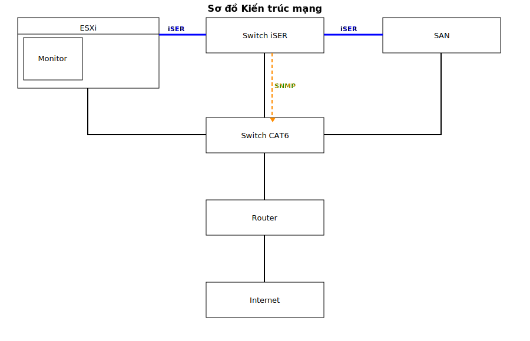
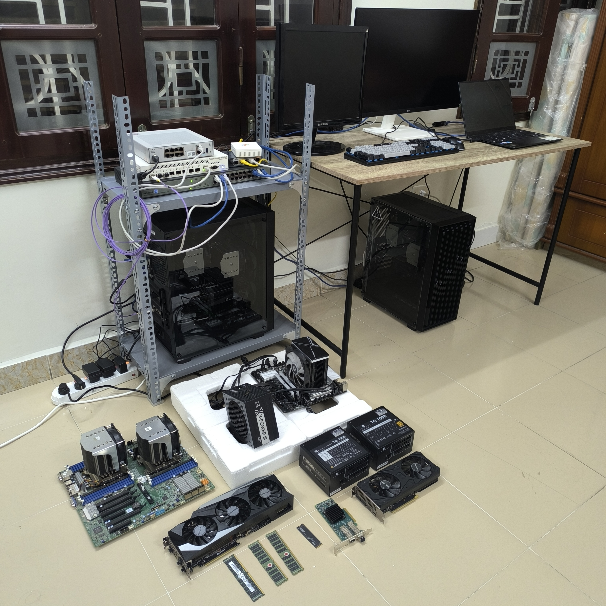

## Danh sách code
- san.sh: code khởi tạo SAN server
- esxi.sh: code khởi tạo ESXi server
- monitor.sh: code khởi tạo Monitor server
- router.rsc: code cấu hình Router
- switch.rsc: code cấu hình Switch
- iser_monitor.py: code Python agent lấy log từ SAN server
- patch/: các patch vá khi cài đặt chương trình

## Danh sách thiết bị
- SAN server
  + CPU: Dual Intel 8171M 56 nhân, 108 luồng
  + RAM: 4 thanh 64 GB DDR4
  + SSD: 512 GB
  + Mainboard: Huananzhi X11
  + GPU: Dual RTX 3090 (để nghiên cứu AI, trước mắt nghiên cứu RoCEv2 để giao tiếp GPU-GPU cross PC)
  + PSU: Nguồn 2 nguồn 1000 W
  + NIC: Mellanox ConnectX4-Lx, **hỗ trợ đầy đủ iSER**, tối đa 25 GbE
  + Module quang: Hadar 10G, do Switch chỉ hỗ trợ tối đa 10 GbE
- ESXi server:
  + CPU: Dual Intel 8171M 56 nhân, 108 luồng
  + RAM: 4 thanh 64 GB DDR4
  + SSD: 512 GB
  + Mainboard: Huananzhi X11. **ESXi 8 không hỗ trợ mainboard này**
  + NIC: Mellanox ConnectX4-Lx, **hỗ trợ đầy đủ iSER**
  + Module quang: Hadar 10G, do Switch chỉ hỗ trợ tối đa 10 GbE
- Switch Mikrotik CRS309-1G-8S+IN: **hỗ trợ đầy đủ iSER**, tối đa 10 GbE, nhưng để tăng độ khó bài lab, giả sử rằng nó không hỗ trợ iSER
- Router Mikrotik heyS: thiết bị mặc định của nhà mạng FPT
- Switch cáp đồng 24 port no name

Hệ thống có hiệu năng/giá thành rất cao
- Dual Intel 8171M có đến 56 nhân, 108 luồng, chỉ đắt ở mainboard, CPU + Mainboard chỉ khoảng 20 triệu
- Dual RTX 3090 với NVLink tổng 48 GB VRAM chỉ 38 triệu, tổng số nhân CUDA bằng RTX 5090. Nhưng RTX 5090 giá 110 triệu và chỉ 32 GB VRAM
- Mikrotik CRS309, Mellanox ConnectX4-Lx là nhưng thiết bị giá rẻ nhất mà có tính năng iSER

Có khả năng tháo lắp máy chủ, tra keo tản nhiệt, nối dây mạng, tư vấn thiết bị

## Thành phần mềm
- SAN Server:
  + Image iSCSI target
  + Tinh chỉnh iSER với cấu hình DCQCN
  + NAS server NFS, song song bên cạnh iSCSI
  + Zabbix agent
  + Code Python feed data cho Zabbix agent
  + Salt master
- ESXi server
  + Chứa máy ảo Monitor server
  + Nhận image iSCSI làm ổ cứng ngoài thứ nhất
  + Nhận NAS làm ổ cứng ngoài thứ hai
- Monitor server
  + Zabbix server
  + Zabbix web
  + PostgreSQL cho Zabbix server
  + PGbouncer bọc PostgreSQL
  + Nginx cho Zabbix web
  + ModSecurity WAF rule bot cho Nginx
  + Nginx build hỗ trợ HTTP3
  + Salt minion
  + Tường lửa iptables
- Router
  + Dịch vụ DNS nội bộ
  + Dịch vụ NTP giúp mạng đồng bộ với các pool đồng hồ nguyên tử quốc tế
  + Dịch vụ DHCP
  + Dịch vụ NAT đưa bài lab ra internet
  + Tường lửa tích hợp
